# Augmented-Reality-Visualization-System

You may (or may not) have heard of or seen the augmented reality Invizimals video game or the Topps 3D baseball cards. The main idea is to render in the screen of a tablet, PC or smartphone a 3D model of a specific figure on top of a card according to the position and orientation of the card. 

# Where do we start?
Looking at the project as a whole may make it seem more difficult than it really is. Luckily for us, we will be able to divide it into smaller parts that, when combined one on top of another, will allow us to have our augmented reality application working. The question now is, which are these smaller chunks that we need? 

To achieve this we first have to be able to identify the flat surface of reference in an image or video frame. Once identified, we can easily determine the transformation from the reference surface image (2D) to the target image (2D). This transformation is called homography. However, if what we want is to project a 3D model placed on top of the reference surface to the target image we need to extend the previous transformation to handle cases were the height of the point to project in the reference surface coordinate system is different than zero. This can be achieved with a bit of algebra. Finally, we should apply this transformation to our 3D model and draw it on the screen. Bearing the previous points in mind our project can be divided into:

          1.  Recognize the reference flat surface.

          2.  Estimate the homography.

          3.  Derive from the homography the transformation from the reference surface coordinate system to the target image coordinate system.

          4.  Project our 3D model in the image (pixel space) and draw it.

# Figure 1: Overview of the whole process that brings to life our augmented reality application.
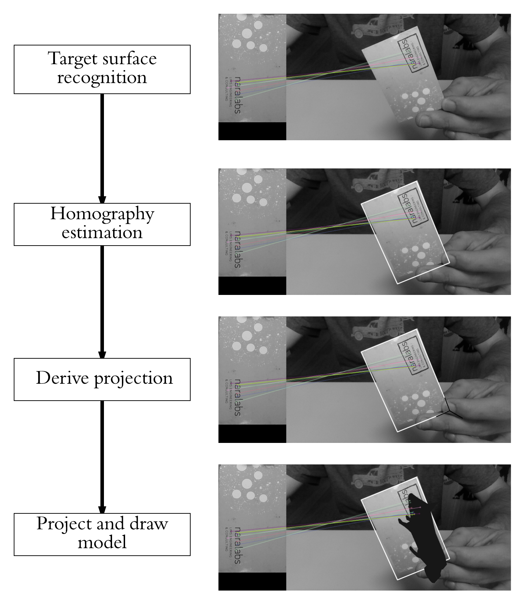

The main tools we will use are Python and OpenCV because they are both open source, easy to set up and use and it is fast to build prototypes with them. For the needed algebra bit I will be using numpy.

# Recognizing the target surface
From the many possible techniques that exist to perform object recognition I decided to tackle the problem with a feature based recognition method. This kind of methods, without going into much detail, consist in three main steps: feature detection or extraction, feature description and feature matching.

# Feature extraction
Roughly speaking, this step consists in first looking in both the reference and target images for features that stand out and, in some way, describe part the object to be recognized. This features can be later used to find the reference object in the target image. We will assume we have found the object when a certain number of positive feature matches are found between the target and reference images. For this to work it is important to have a reference image where the only thing seen is the object (or surface, in this case) to be found.  We don’t want to detect features that are not part of the surface. And, although we will deal with this later, we will use the dimensions of the reference image when estimating the pose of the surface in a scene.

For a region or point of an image to be labeled as feature it should fulfill two important properties: first of all, it should present some uniqueness at least locally. Good examples of this could be corners or edges. Secondly, since we don’t know beforehand which will be, for example, the orientation, scale or brightness conditions of this same object in the image where we want to recognize it a feature should, ideally, be invariant to transformations; i.e, invariant against scale, rotation or brightness changes. As a rule of thumb, the more invariant the better.

# Figure 2: On the left, features extracted from the model of the surface I will be using. On the right, features extracted from a sample scene. Note how corners have been detected as interest points in the rightmost image.
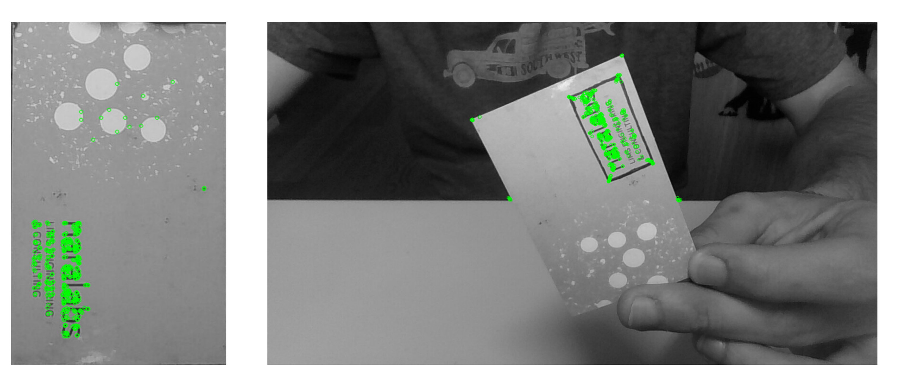

# Feature description
Once features have been found we should find a suitable representation of the information they provide. This will allow us to look for them in other images and also to obtain a measure of how similar two detected features are when being compared. This is were descriptors roll in.  A descriptor provides a representation of the information given by a feature and its surroundings. Once the descriptors have been computed the object to be recognized can then be abstracted to a feature vector,  which is a vector that contains the descriptors of the keypoints found in the image with the reference object.

This is for sure a nice idea, but how can it actually be done? There are many algorithms that extract image features and compute its descriptors and, since I won’t go into much more detail (a whole post could be devoted only to this) if you are interested in knowing more take a look at SIFT, SURF, or Harris. The one we will be using was developed at the OpenCV Lab and it is called ORB (Oriented FAST and Rotated BRIEF). The shape and values of the descriptor depend on the algorithm used and, in our case,  the descriptors obtained will be binary strings.

With OpenCV, extracting features and its descriptors via the ORB detector is as easy as:

          img = cv2.imread('scene.jpg',0)
          
          # Initiate ORB detector
          orb = cv2.ORB_create()
          
          # find the keypoints with ORB
          kp = orb.detect(img, None)
          
          # compute the descriptors with ORB
          kp, des = orb.compute(img, kp)
          
          # draw only keypoints location,not size and orientation
          img2 = cv2.drawKeypoints(img, kp, img, color=(0,255,0), flags=0)
          cv2.imshow('keypoints',img2)
          cv2.waitKey(0)

# Feature matching
Once we have found the features of both the object and the scene were the object is to be found and computed its descriptors it is time to look for matches between them. The simplest way of doing this is to take the descriptor of each feature in the first set, compute the distance to all the descriptors in the second set and return the closest one as the best match (I should state here that it is important to choose a way of measuring distances suitable with the descriptors being used. Since our descriptors will be binary strings we will use Hamming distance). This is a brute force approach, and more sophisticated methods exist.

For example, and this is what we will be also using, we could check that the match found as explained before is also the best match when computing matches the other way around, from features in the second set to features in the first set. This means that both features match each other. Once the matching has finished in both directions we will take as valid matches only the ones that fulfilled the previous condition. Figure 4 presents the best 15 matches found using this method.

Another option to reduce the number of false positives would be to check if the distance to the second to best match is below a certain threshold.  If it is, then the match is considered valid.

# Figure 3: Closest 15 brute force matches found between the reference surface and the scene
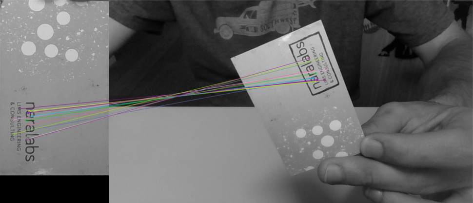

Finally, after matches have been found, we should define some criteria to decide if the object has been found or not. For this I defined a threshold on the minimum number of matches that should be found. If the number of matches is above the threshold, then we assume the object has been found. Otherwise we consider that there isn’t enough evidence to say that the recognition was successful.

# With OpenCV all this recognition process can be done in a few lines of code:
          MIN_MATCHES = 15
          cap = cv2.imread('scene.jpg', 0)    
          model = cv2.imread('model.jpg', 0)
          # ORB keypoint detector
          orb = cv2.ORB_create()              
          # create brute force  matcher object
          bf = cv2.BFMatcher(cv2.NORM_HAMMING, crossCheck=True)  
          # Compute model keypoints and its descriptors
          kp_model, des_model = orb.detectAndCompute(model, None)  
          # Compute scene keypoints and its descriptors
          kp_frame, des_frame = orb.detectAndCompute(cap, None)
          # Match frame descriptors with model descriptors
          matches = bf.match(des_model, des_frame)
          # Sort them in the order of their distance
          matches = sorted(matches, key=lambda x: x.distance)
          
          if len(matches) > MIN_MATCHES:
              # draw first 15 matches.
              cap = cv2.drawMatches(model, kp_model, cap, kp_frame,
                                     matches[:MIN_MATCHES], 0, flags=2)
              # show result
              cv2.imshow('frame', cap)
              cv2.waitKey(0)
          else:
              print "Not enough matches have been found - %d/%d" % (len(matches),MIN_MATCHES)

On a final note and before stepping into the next step of the process I must point out that, since we want a real time application, it would have been better to implement a tracking technique and not just plain recognition. This is due to the fact that object recognition will be performed in each frame independently without taking into account previous frames that could add valuable information about the location of the reference object. Another thing to take into account is that, the easier to found the reference surface the more robust detection will be. In this particular sense, the reference surface I’m using might not be the best option, but it helps to understand the process.

#Homography estimation
Once we have identified the reference surface in the current frame and have a set of valid matches we can proceed to estimate the homography between both images. As explained before, we want to find the transformation that maps points from the surface plane to the image plane (see Figure 4). This transformation will have to be updated each new frame we process.

# Fgure 4: Homography between a plane and an image. Source: F. Moreno.
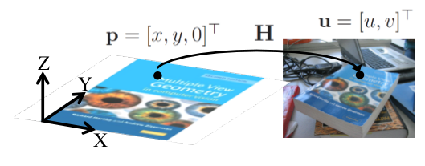

How can we find such a transformation? Since we have already found a set of matches between both images we can certainly find directly by any of the existing methods (I advance we will be using RANSAC) an homogeneous transformation that performs the mapping, but let’s get some insight into what we are doing here (see Figure 5). You can skip the following part (and continue reading after Figure 9) if desired, since I will only explain the reasoning behind the transformation we are going to estimate.

What we have is an object (a plane in this case) with known coordinates in the, let’s say, World coordinate system and we take a picture of it with a camera located at a certain position and orientation with respect to the World coordinate system. We will assume the camera works following the pinhole model, which roughly means that the rays passing through a 3D point p and the corresponding 2D point u intersect at c, the camera center. A good resource if you are interested in knowing more about the pinhole model can be found here.

# Figure 5: Image formation assuming a camera pinhole model.  Source: F. Moreno.
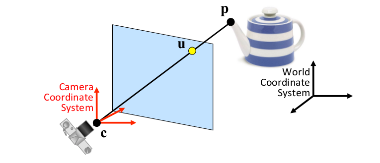

Although not entirely true, the pinhole model assumption eases our calculations and works well enough for our purposes. The u, v coordinates (coordinates in the image plane) of a point p expressed in the Camera coordinate system if we assume a pinhole camera can be computed as (the derivation of the equation is left as an exercise to the reader):

# Figure 6: Image formation assuming a pinhole camera model. Source: F. Moreno.
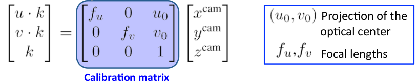

Where the focal length is the distance from the pinhole to the image plane, the projection of the optical center is the position of the optical center in the image plane and k is a scaling factor. The previous equation then tells us how the image is formed. However, as stated before, we know the coordinates of the point p in the World coordinate system and not in the Camera coordinate system, so we have to add another transformation that maps points from the World coordinate system to the Camera coordinate system. The transformation that tells us the coordinates in the image plane of a point p in the World coordinate system is then:

# Figure 7: Computation of the projection matrix. Source: F. Moreno.

Luckily for us, since the points in the reference surface plane do always have its z coordinate equal to 0 (see Figure 4) we can simplify the transformation that we found above. It can be easily seen that the product of the z coordinate and the third column of the projection matrix will always be 0 so we can drop this column and the z coordinate from the previous equation. By renaming the calibration matrix as A and taking into account that the external calibration matrix is an homogeneous transformation:

# Figure 8: Simplification of the projection matrix. Source: F. Moreno.
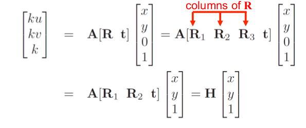

From Figure 8 we can conclude that the homography between the reference surface and the image plane, which is the matrix we will estimate from the previous matches we found is:

# Figure 9: Homography between the reference surface plane and the target image plane. Source: F. Moreno.
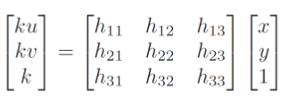

There are several methods that allow us to estimate the values of the homography matrix, and you maight be familiar with some of them. The one we will be using is RANdom SAmple Consensus (RANSAC).  RANSAC is an iterative algorithm used for model fitting in the presence of a large number of outliers, and Figure 11 ilustrates the main outline of the process. Since we cannot guarantee that all the matches we have found are actually valid matches we have to consider that there might be some false matches (which will be our outliers) and, hence, we have to use an estimation method that is robust against outliers. Figure 10 illustrates the problems we could have when estimating the homography if we considered that there were no outliers.

# Figure 10: Homography estimation in the presence of outliers. Source: F. Moreno.
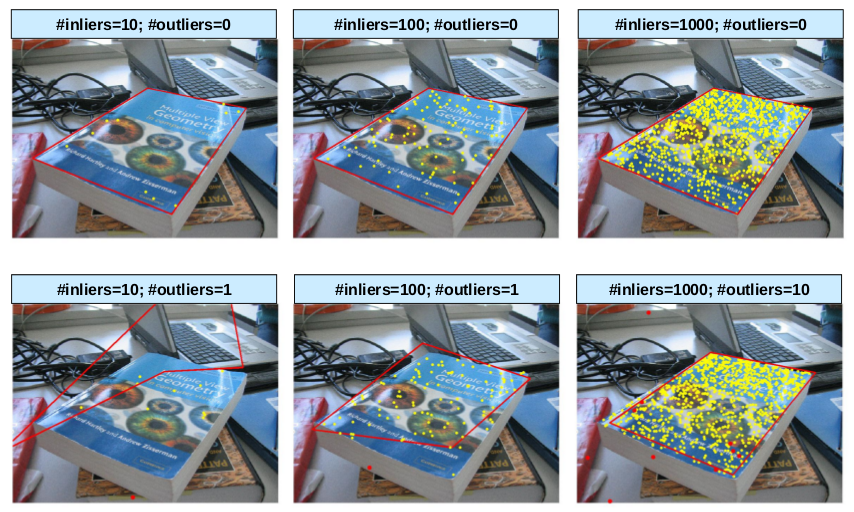

# Figure 11: RANSAC algorithm outline. Source: F. Moreno.

As a demonstration of how RANSAC works and to make things clearer, assume we had the following set of points for which we wanted to fit a line using RANSAC:

# Figure 12: Initial set of points. Source: F. Moreno
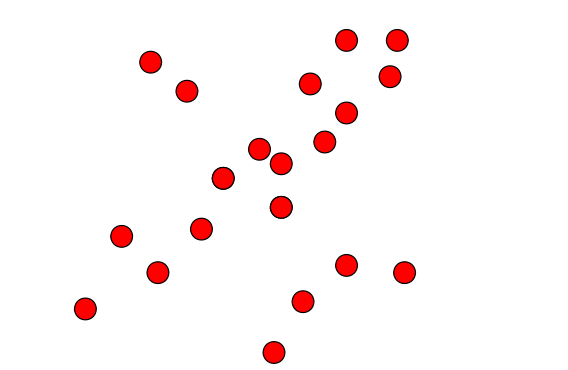

From the general outline presented in Figure 12 we can derive the specific process to fit a line using RANSAC (Figure 13).

# Figure 13: RANSAC algorithm to fit a line to a set of points. Source: F. Moreno.
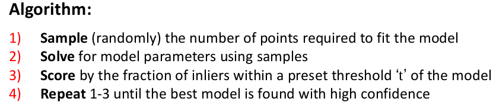

A possible outcome of running the algorithm presented above can be seen in Figure 14. Note that the first 3 steps of the algorithm are only shown for the first iteration (indicated by the bottom right number), and from that on only the scoring step is shown.

# Figure 14: Using RANSAC to fit a line to a set of points. Source: F. Moreno.
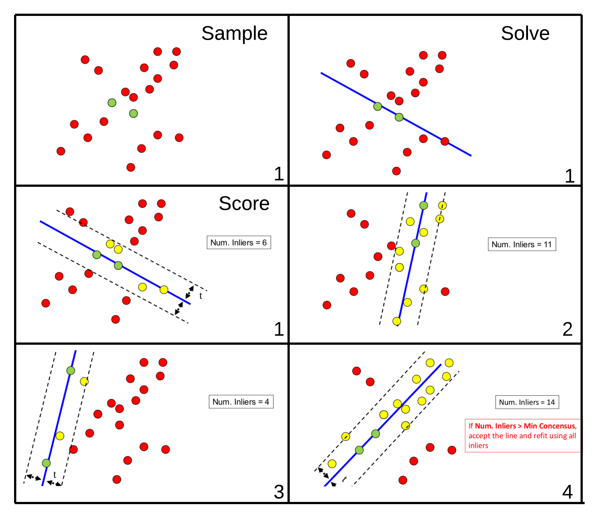

Now back to our use case, homography estimation. For homography estimation the algorithm is presented in Figure 15. Since it is mainly math, I won’t go into details on why 4 matches are needed or on how to estimate H. However, if you want to know why and how it’s done, this is a good explanation of it.

# Figure 15: RANSAC for homography estimation. Source: F. Moreno.
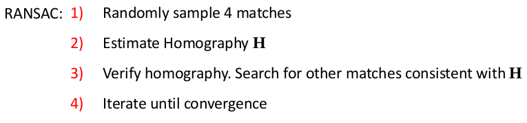

Before seeing how OpenCV can handle this for us we should  discuss one final aspect of the algorithm, which is what does it mean that a match is consistent with H. What this mainly means is that if after estimating an homography we project into the target image the matches that were not used to estimate it then the projected points from the reference surface should be close to its matches in the target image. How close they should be to be considered consistent is up to you.

I know it has been tough to reach this point, but thankfully there is a reward. In OpenCV estimating the homography with RANSAC is as easy as:

          # assuming matches stores the matches found and 
          # returned by bf.match(des_model, des_frame)
          # differenciate between source points and destination points
          src_pts = np.float32([kp_model[m.queryIdx].pt for m in matches]).reshape(-1, 1, 2)
          dst_pts = np.float32([kp_frame[m.trainIdx].pt for m in matches]).reshape(-1, 1, 2)
          # compute Homography
          M, mask = cv2.findHomography(src_pts, dst_pts, cv2.RANSAC, 5.0)

Where 5.0 is the threshold distance to determine if a match is consistent with the estimated homography. If after estimating the homography we project the four corners of the reference surface on the target image and connect them with a line we should expect the resulting lines to enclose the reference surface in the target image. We can do this by:

          # Draw a rectangle that marks the found model in the frame
          h, w = model.shape
          pts = np.float32([[0, 0], [0, h - 1], [w - 1, h - 1], [w - 1, 0]]).reshape(-1, 1, 2)
          # project corners into frame
          dst = cv2.perspectiveTransform(pts, M)  
          # connect them with lines
          img2 = cv2.polylines(img_rgb, [np.int32(dst)], True, 255, 3, cv2.LINE_AA) 
          cv2.imshow('frame', cap)
          cv2.waitKey(0)

which results in:

# Figure 16: Projected corners of the reference surface with the estimated homography.
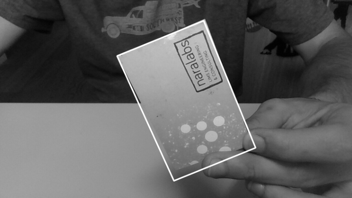

I think this is enough for today. On the next post we will see how to extend the homography we already estimated to project not only points in the reference surface plane but any 3D point from the reference surface coordinate system to the target image. We will then use this method to compute in real time, for each video frame, the specific projection matrix and then project in a video stream a 3D model of our choice from an .obj file. What you can expect at the end of the next post is something similar to what you can see in the gif below:

